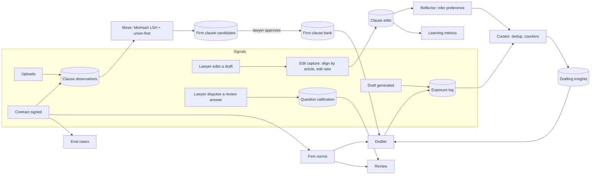

# Firm Learning Loop — Architecture

Status: implemented on `feat/ai-quality-foundations` · Date: 2026-09-26

**Goal:** every contract a firm uploads, every edit a lawyer makes to a draft, every
contract that gets signed and every review finding a lawyer rejects makes the next
draft and the next review measurably better — for that firm, without retraining a model
and without a lawyer ever losing control of what the system treats as "firm standard".

---

## 1. What the industry does (2025–2026)

| Technique | Where it comes from | What we take from it |
|---|---|---|
| **Firm clause bank / playbooks built from the firm's own "golden" contracts, lawyer sign-off before use** | Harvey workflow agents learn from accept/reject/refine decisions on redlines; Spellbook and Harvey generate playbooks from repository contracts, but a lawyer must sign off before a generated standard governs a draft ([Harvey](https://www.harvey.ai/blog/ai-contract-generator), [Spellbook](https://spellbook.com/learn/ai-legal-contract-review-faster-analysis)) | Mine clauses from uploaded and signed contracts → candidates → lawyer approves → drafter uses firm clauses before shipped templates |
| **Near-duplicate clustering with MinHash + LSH** | Standard for grouping text that shares most surface wording, with predictable scaling ([MinHash dedup](https://blog.nelhage.com/post/fuzzy-dedup/)) | Clause variants cluster by 5-word shingles; cluster support = how often the firm uses that wording |
| **Learning latent preferences from user edits (PRELUDE / CIPHER)** | Microsoft Research, NeurIPS 2024: infer a natural-language preference from each (agent output, user edit) pair, retrieve preferences from similar contexts, lower edit cost over time ([paper](https://arxiv.org/abs/2404.15269)) | "Reflector" turns each significant lawyer edit into short drafting rules scoped to clause/contract type |
| **Evolving playbooks — Agentic Context Engineering (ACE)** | Stanford/SambaNova/Berkeley 2025: context as itemised bullets with helpful/harmful counters, Generator → Reflector → Curator, incremental delta updates and dedup to avoid context collapse ([paper](https://arxiv.org/abs/2510.04618)) | Insights are bullets with evidence/helpful/harmful counters, merged deterministically (no LLM rewrite of the whole playbook), deduplicated, auto-retired when harmful |
| **Evaluator calibration against human corrections** | EvalGen ("who validates the validators"), LangSmith Align Evals: collect corrections, use them as few-shot examples, track agreement ([EvalGen](https://dl.acm.org/doi/abs/10.1145/3654777.3676450), [LangChain](https://www.langchain.com/resources/llm-as-a-judge)) | Lawyers dispute individual review answers → per-question precision → score weights + few-shot corrections in the question prompt |
| **Deal-point benchmarking** | Spellbook "Compare to Market" benchmarks terms against anonymised agreement data ([Spellbook](https://spellbook.com/learn/ai-legal-contract-review-faster-analysis)) | Firm norms: distributions of notice period, governing law, liability cap, venue across the firm's signed contracts |
| **Data-flywheel guardrails** | "The data flywheel trap": implicit signals are demand not correctness, delayed outcomes, popularity amplification, log exposure ([TianPan](https://tianpan.co/blog/2026/04/20/data-flywheel-trap), [Agent-in-the-loop](https://arxiv.org/pdf/2510.06674)) | Exposure log, signal strength, signed contract = ground truth, no ranking by usage, human gates |

Deliberately **not** first: per-firm fine-tuning (LoRA/DPO on edit pairs) and offline prompt
optimisation (DSPy/GEPA). They need hundreds of clean (draft, final) pairs; this
architecture is what produces those pairs. They are the last phase (§9).

## 2. Current state (before this change)

| Signal | Captured | Used |
|---|---|---|
| Uploaded contracts | indexed in pgvector | weak RAG precedent; golden-first drafting ignores it for 12/14 clause types |
| Golden clauses | 83 shipped in YAML | static; the DB clause-library "golden" flag is a separate system used only as RAG context |
| Extraction corrections | yes | yes — alias overrides (the only live loop) |
| Q&A ratings | yes | averaged only |
| Lawyer edits of AI drafts | ONLYOFFICE versions | unused |
| Signed contracts | lifecycle EXECUTED | deadlines only |
| Finding decisions | FindingStatus | unused |

Two things got worse with volume: RAW (non-anonymised) chunks from any matter were eligible
drafting precedent, and saved AI drafts re-entered the precedent pool.

## 3. Architecture

Four layers:

1. **Signals** — events already emitted by the platform (draft completed, version saved,
   contract executed) plus one new explicit action (dispute a review answer).
2. **Stores** — seven tables (§6), all firm-scoped by deployment (one firm per VM).
3. **Learners** — deterministic code first (mining, alignment, counters, statistics);
   the LLM is used only for the Reflector, and never rewrites stored knowledge wholesale.
4. **Consumers** — drafter (firm clause → shipped golden → LLM with learned insights and
   firm-norm defaults), review (calibrated weights, few-shot corrections, norm deviations),
   metrics and eval export.

## 4. Phase 0 — foundations (fixed before any learning)

| Issue | Fix |
|---|---|
| RAW (real-name) chunks eligible as drafting precedent across matters | `DraftContextRetriever` admits RAW chunks only from the draft's own matter; everything else must be the ANONYMIZED pool |
| Q&A without a matter returned RAW chunks from every matter | `AiService.query` excludes RAW chunks when no matter is selected |
| Unreviewed AI drafts re-indexed as precedent | chunks with `source` DRAFTED / DRAFT_ASYNC are excluded from drafting precedent |
| Full-text retrieval concatenated both pools (every clause twice, half anonymised) | full-text reads only the RAW pool (or legacy untagged chunks) — fixes review of uploads too |
| Deleting a document left its chunks, BM25 rows and files | delete removes embeddings, chunk-search rows, stored file, sidecars |

## 5. Components

### 5.1 Exposure log (what the system showed)
On draft completion `DraftService` writes one `draft_clause_exposures` row per article:
`clause_key`, `provenance` (FIRM_BANK / GOLDEN / LLM), `firm_clause_id`, `insight_ids`,
`generated_text` (encrypted). Every later learning step joins on this — without it we could
not tell whether a firm clause or an insight was actually in front of the lawyer
(flywheel-trap requirement #1).

### 5.2 Edit capture (early signal)
Trigger: ONLYOFFICE saves a new version of an AI draft (`DocumentRevisedEvent`), or the
draft is executed (`DocumentExecutedEvent`, final).
1. Extract text from the saved file (Tika), split on `ARTICLE n — TITLE` headings.
2. Align articles to the exposure log by title (fallback: article number).
3. `edit_ratio` = token-level Levenshtein distance / max(len) — 0 = untouched, 1 = rewritten.
4. Upsert `clause_edits` (latest version wins; `is_final` on execution).

Edits are **early, noisy** signals (a half-finished edit session); execution is the
**delayed, reliable** outcome. Insight evidence counts distinct documents; firm-bank
mining only uses final text.

### 5.3 Reflector → Curator → Drafting insights (CIPHER + ACE)
- **Reflector** (LLM, one call per significant edit, `edit_ratio ≥ 0.15`): given the AI
  clause and the lawyer's version, output 0–3 short imperative drafting preferences
  ("State the liability cap as a multiple of fees paid in the prior 12 months"), or none.
  Prompt: `LEARNING_REFLECT_EDIT` (overridable).
- **Curator** (deterministic): each preference is matched against existing insights for the
  same clause/contract type by word-shingle Jaccard ≥ 0.6. Match → `evidence_count++`,
  document id added to `evidence_docs`; no match → new PROPOSED insight.
- **Activation**: PROPOSED → ACTIVE when supported by ≥ 3 distinct documents
  (`legalpartner.learning.insights.auto-activate-docs`), or immediately by a lawyer.
  `auto-activate: false` makes every insight lawyer-approved.
- **Use**: up to 5 ACTIVE insights for the clause (clause-type match, contract-type match
  preferred, ranked by helpful − harmful then evidence) are injected into LLM clause
  prompts as "FIRM DRAFTING PREFERENCES". Their ids go into the exposure log.
- **Outcome counters (ACE)**: when a clause that was drafted with insights is later edited,
  `edit_ratio ≤ 0.10` → helpful++, `≥ 0.30` → harmful++ for those insights. An insight with
  harmful ≥ 3 and harmful > 2 × helpful is auto-RETIRED.

### 5.4 Firm clause bank (from uploads and signed contracts)
- **Observations**: for every indexed firm document (source USER/CLOUD, never EDGAR, never
  an unsigned AI draft) and every executed draft, segment clauses with the review
  `ClauseInventory` (headings first), map review keys to drafting keys, store
  `clause_observations` (encrypted text, SHA-256, MinHash signature, `executed` flag).
- **Miner** (scheduled nightly + on demand): per (drafting clause key, contract type),
  MinHash (128 hashes over 5-word shingles) → LSH (32 bands × 4 rows) candidate pairs →
  verify estimated Jaccard ≥ 0.6 → union-find clusters. Cluster **support** = distinct
  documents; **executed support** = distinct signed documents.
- **Candidate**: clusters with support ≥ 2 become CANDIDATE firm clauses. Text = the
  medoid (member with highest mean similarity), templated deterministically: the source
  document's party names → `{{partyA.name}}` / `{{partyB.name}}`; money, dated dates,
  emails, phones → `{{amount}}`, `{{date}}`, … fill-in fields. Re-mining updates support on
  existing candidates (matched by cluster fingerprint) instead of duplicating.
- **Approval**: a lawyer approves (optionally editing the text and choosing position
  PRIMARY / FALLBACK_1 / FALLBACK_2), rejects, or retires. Only APPROVED clauses are used.
- **Drafting order** (golden-first path): firm APPROVED → shipped golden → LLM.
  Stance picks the position: FIRST_DRAFT/BALANCED → PRIMARY, FINAL_OFFER → the most
  conceding approved fallback. Selection never ranks by past usage (no popularity
  amplification); usage is recorded only for metrics.

### 5.5 Review calibration (EvalGen / Align-Evals pattern)
- A lawyer disputes one review answer: `POST /api/v1/ai/risk-assessment/{docId}/disputes`
  `{questionId, clauseType, correctAnswer, quote, note}` → `review_disputes` row.
- Every completed review increments `answered` per question in `question_calibration`.
- **Weight multiplier** = posterior precision / prior precision with a Beta(8, 2) prior,
  clamped to [0.3, 1.0]; no data → 1.0. Applied to question weights in the risk score.
- **Few-shot corrections**: the 3 most recent disputes for a question are appended to that
  question's prompt ("Firm corrections for this question: …").
- Questions with precision < 0.6 after ≥ 10 answers are listed in metrics as "needs rewrite".

### 5.6 Firm norms (deal-point benchmark, within the firm)
From documents in EXECUTED / ACTIVE / EXPIRING / RENEWED status, per document type:
notice period (n, median, p25, p75), governing law (mode, share), liability cap (mode, share),
arbitration venue (mode, share). Minimum support 5.
- Drafting: when the form and brief give no notice period, the firm median replaces the
  generic default (recorded in the draft parameters).
- Review: the risk result gets a key finding when the contract's notice period or governing
  law departs from the firm norm.

### 5.7 Eval growth
Draft manifests now store the deal brief. Every executed AI draft becomes an eval case
(`GET /api/v1/learning/eval-cases`) in `briefs.yml` format: expected terms = party names and
money amounts from the brief that appear in the signed text.

### 5.8 Metrics (is it getting better?)
`GET /api/v1/learning/metrics`: weekly mean edit ratio (overall and per clause type), firm
coverage (share of drafted clauses from FIRM_BANK), insights by status, candidates pending,
review dispute rate, questions needing rewrite.

## 6. Data model (Flyway V35)

| Table | Purpose |
|---|---|
| `draft_clause_exposures` | what each drafted article was built from |
| `clause_edits` | AI vs lawyer text per article, edit ratio, final flag |
| `clause_observations` | segmented firm clauses with MinHash signature |
| `firm_clauses` | candidates and approved firm clauses (status, position, support) |
| `drafting_insights` | learned preferences with evidence/helpful/harmful counters |
| `review_disputes` | lawyer corrections of review answers |
| `question_calibration` | answered / disputed counts per question and contract type |

All clause text is encrypted with the same Jasypt key as RAG chunks.

## 7. APIs

Roles for each action come from `learning.yml access` (default: curate = ADMIN/PARTNER,
dispute = ADMIN/PARTNER/ASSOCIATE), enforced with `@PreAuthorize("@learningAccess…")`.

| Method | Path | Purpose |
|---|---|---|
| GET | `/api/v1/learning/settings` | positions, stances, statuses, caller's permissions (the UI hardcodes none) |
| GET | `/api/v1/learning/firm-clauses?status=` | candidates / approved / rejected / retired |
| POST | `/api/v1/learning/firm-clauses/{id}/approve` | `{text?, position?}` |
| POST | `/api/v1/learning/firm-clauses/{id}/reject`, `/retire` | |
| POST | `/api/v1/learning/mine` | run mining now (also nightly: `legalpartner.learning.mining.cron`) |
| GET | `/api/v1/learning/insights?status=` | learned preferences |
| POST | `/api/v1/learning/insights` | add a rule manually (active immediately) |
| POST | `/api/v1/learning/insights/{id}/status` | `{status: PROPOSED|ACTIVE|RETIRED}` |
| GET | `/api/v1/learning/norms/{documentType}` | firm norms |
| GET | `/api/v1/learning/metrics` | learning metrics |
| POST | `/api/v1/ai/risk-assessment/{docId}/disputes` | correct a review answer (matter membership enforced) |

## 8. Guardrails

| Risk | Guardrail |
|---|---|
| Cross-client leakage | Phase 0 pool fixes; firm clauses are templated (names/amounts/dates removed) and lawyer-approved |
| Learning from unreviewed AI output | AI drafts never enter precedent or mining unless executed |
| Noisy implicit signals | edits only propose insights; activation needs ≥ 3 documents or a lawyer; signed contracts are the only mining source for drafts |
| Popularity amplification | firm clause selection by approval + position, never by usage |
| Context collapse / prompt bloat | ≤ 5 insights per clause, deterministic merge, auto-retire on harm |
| Silent regressions | metrics endpoint + eval export feed the drafting eval gate |
| Opt-out | `legalpartner.learning.enabled=false` turns every learner and consumer off |

## 9. Later phases

1. **Offline prompt optimisation** (DSPy/GEPA) against the growing eval set.
2. **Preference fine-tuning** (DPO/LoRA) on (AI clause, lawyer final) pairs once a firm has
   several hundred executed drafts — per-firm adapter, gated on the eval.
3. **Cross-firm benchmark** ("give-to-get", anonymised deal points) — only with explicit
   contracts and aggregation thresholds.

## 10. Implementation status

**Wired (all behind `legalpartner.learning.enabled`):**

| Loop step | Where |
|---|---|
| Observe firm documents on index and on signing | `LearningEventListener` ← `DocumentIndexedEvent`, `DocumentExecutedEvent` |
| Capture lawyer edits of AI drafts (firm sources only; counterparty redlines ignored) | `DocumentRevisedEvent` from the editor and version uploads, `learning.yml edits.firm_edit_sources` |
| Final capture on signing → insight helpful/harmful counters | `DocumentExecutedEvent` |
| Forget on delete | `DocumentDeletedEvent` |
| Drafting: approved firm clause → shipped golden clause → LLM | `DraftService.firmClauseFor` (async drafts) |
| Drafting: active learned preferences in the clause prompt (incl. retries) | `DraftService.generateClauseWithQa` (all draft paths) |
| Drafting: exposure log (what each article came from) | `DraftService.recordExposures` (async drafts) |
| Drafting: firm-norm defaults for empty deal terms | `FirmNormsService.applyDraftingDefaults` (`norms.rules[].drafting_default` = DealSpec property path) |
| Review: calibrated question weights | `RiskQuestionEngine.computeFullReport(…, multipliers)` |
| Review: latest lawyer corrections as few-shot examples | `SemanticRequirementChecker` (also used by draft verification) |
| Review: firm-norm deviations in key findings | `AiService.withFirmNorms` |
| Lawyer gate + metrics UI | `Firm Knowledge` page; "Mark wrong" on each review answer |

Tests: `LearningLoopFlowTest` runs the loop end to end on the real V35 schema (edit → preference
→ prompt → outcome credit; mine → approve → select → render; dispute → weight + few-shot;
delete → forget), plus `LearningPolicyTest`, `LearningAlgorithmsTest`, `RiskScoreCalibrationTest`.

**Closed since the first wiring:**
- **One drafting pipeline for every entry point.** `/draft`, `/draft/stream` and async drafts all run
  `DraftService.runDraftPipeline` (deal spec → firm clause → golden → LLM → rules → rubric verification →
  normalization → manifest). Previously the sync/stream paths skipped DealSpec, golden clauses, the rule
  engine, verification and normalization entirely.
- **Sync/stream drafts reach review and learning.** Their response carries a `draftToken`
  (`PendingDraftStore`: in memory, per user, single use, `legalpartner.draft.pending.ttl-hours`). Saving with
  it attaches the exposure log, and the draft manifest when the saved HTML is unchanged
  (otherwise review reads the saved text).
- **Calibration counts each (document, question) once** (`review_answer_log`, V36); a repeated correction
  updates the dispute instead of counting again; deleting a document reverses both its answer and dispute counts.
- **Eval-case export**: `GET /api/v1/learning/eval-cases` turns signed AI drafts into `eval/drafting` briefs
  (the manifest now keeps the deal brief), with the signed clause text as `reference_clauses`, which the
  harness judge uses. Anonymized by default and **fail-closed**: a case is dropped if anonymization returns
  nothing or a client name survives.

**Still open:** no measured effect — run the eval baseline, then compare `metrics.editsBySource` over time.
